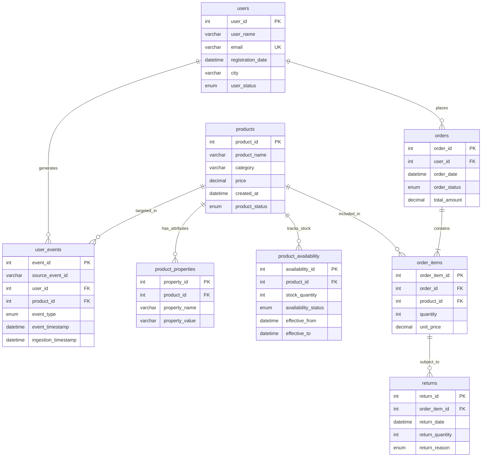

# Entity-Relationship (ER) Diagram
## Relational Schema for Recommendation Engine Data Pipeline

```mermaid
erDiagram
    users ||--o{ user_events : "generates"
    users ||--o{ orders : "places"
    products ||--o{ user_events : "targeted_in"
    products ||--o{ product_properties : "has_attributes"
    products ||--o{ product_availability : "tracks_stock"
    products ||--o{ order_items : "included_in"
    orders ||--|{ order_items : "contains"
    order_items ||--o{ returns : "subject_to"

    users {
        int user_id PK
        varchar user_name
        varchar email UK
        datetime registration_date
        varchar city
        enum user_status
    }

    products {
        int product_id PK
        varchar product_name
        varchar category
        decimal price
        datetime created_at
        enum product_status
    }

    product_properties {
        int property_id PK
        int product_id FK
        varchar property_name
        varchar property_value
    }

    product_availability {
        int availability_id PK
        int product_id FK
        int stock_quantity
        enum availability_status
        datetime effective_from
        datetime effective_to
    }

    user_events {
        int event_id PK
        varchar source_event_id
        int user_id FK
        int product_id FK
        enum event_type
        datetime event_timestamp
        datetime ingestion_timestamp
    }

    orders {
        int order_id PK
        int user_id FK
        datetime order_date
        enum order_status
        decimal total_amount
    }

    order_items {
        int order_item_id PK
        int order_id FK
        int product_id FK
        int quantity
        decimal unit_price
    }

    returns {
        int return_id PK
        int order_item_id FK
        datetime return_date
        int return_quantity
        enum return_reason
    }
```
